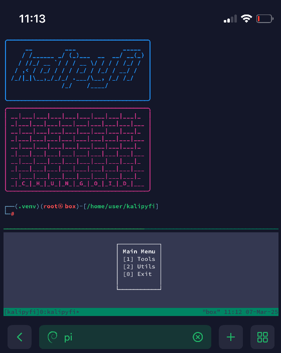

<div align="center">
  
</div>

Kalipyfi is a modular, interactive scanning and network management platform designed for security professionals and network administrators. It integrates a suite of powerful tools—**hcxtool**, **nmap**, and **pyfyconnect**—into a unified, terminal-based interface leveraging tmux and curses. Moreover, Kalipyfi is built for extensibility, enabling developers to create and integrate custom tool plugins with ease.

## Table of Contents
- [Installation](#installation)
- [Usage](#usage)
  - [hcxtool](#hcxtool)
  - [nmap](#nmap)
  - [pyfyconnect](#pyfyconnect)
- [Configuration Files](#configuration-files)
  - [config.yaml](#configyaml)
  - [defaults.yaml](#defaultsyaml)
- [Extending Kalipyfi (Plugin Development)](#extending-kalipyfi-plugin-development)
  - [Core Components](#core-components)
  - [Step-by-Step Guide](#step-by-step-guide)
  - [Example Templates](#example-templates)
- [License](#license)
- [Contributing](#contributing)

## Installation

```bash
# Clone the repository
git clone https://github.com/chungoid/kalipyfi.git
cd kalipyfi

# Set up a virtual environment and install dependencies
python3 -m venv .venv
source .venv/bin/activate
pip install -r requirements.txt

# Configure the base directory in Kalipyfi (do not edit source code)
# Set the full path to your Kalipyfi directory:
export KALIPYFI_DIR="/fullpath/to/kalipyfi/"

# Run the application (sudo required for some network operations)
sudo kalipyfi
```

# Usage

Kalipyfi integrates access to all tools into a single two-pane tmux window. Access tool specific submenus from the main menu by selecting `[1] Tools` and then from any given tools 'View' menu option you may selectively swap background panes into view within the main user-interface.

### hcxtool

    Purpose: Performs wireless scans using hcxdumptool.
    Features:
        Captures wireless traffic and stores results in a local SQLite database.
        Exports scan results to an interactive HTML map (if GPS data is enabled) where each network has its location pinned & a viewable tag for displaying data.
        Supports upload/download operations via WPA-sec integration as well as merging pcapng results with downloaded results into the database.
        Allows defining custom scan configurations through CLI arguments in its config.yaml.
        Provides an additional cli arg 'autobpf' which creates a list of mac addresses (interfaces, stations, or hotspot clients) associated with the scan device & protects them from the scan interface.

### nmap

    Purpose: Conducts comprehensive network scans.
    Features:
        Offers an interactive submenu for target selection and scan execution.
        Automatically parses network gateways from all available interfaces & allows users to choose a network.
        Chosen network gateways are set to cidr format & an initial ping scan populates a new nmap_networks table entry with all known hosts.
        Further selection of host scan allows for individual host scans or ALL where hosts ports, services, and nse results are inserted into the nmap_host table.
        Upon completion of host scans each hosts services are examined by searchsploit.

### pyfyconnect

    Purpose: Manages network connections via wpa_supplicant.
    Features:
        Generates secure wpa_supplicant configurations.
        Supports both manual and automatic connection workflows.
        Automatic connections are handled by presenting a list of available networks from the database.
        Manual connections prompt the user to select an available network & enter the passphrase manually.
        Cleanly disconnects and manages DHCP leases without saving any networks to networkmanager.


# Configuration Files

### config.yaml

Each tool (hcxtool, nmap, pyfyconnect, etc.) includes its own config.yaml file containing tool-specific settings. These files typically define:

    Interfaces: Lists of available network interfaces nested by type (e.g. wlan for wifi, bt for bluetooth, etc) to create a logical separation but maintain extendability.
    Presets: Predefined scan profiles with descriptive names and CLI options.
    Custom Options: Extra settings that control the behavior of each tool. (e.g. wpasec-key in 'tools/hcxtool/configs/config.yaml' enabling upload/download via api request)

### defaults.yaml

The defaults.yaml file provides baseline CLI argument values. Its primary role is to support the "create new scan profile" functionality within the submenus:

    It provides the current set of available cli args for any given tool so users can create custom config presets from a command builder via submenu prompts.
    For each available arg the user is prompted to choose from T/F for empty values (represent booleans) or prompted to enter a string for "" values.
    Updating a tools defaults.yaml to reflect any changes in the underlying CLI options allows quick updates without modifying a tool’s code.

# Extending Kalipyfi (Plugin Development)

Kalipyfi is built on a modular architecture that makes it easy to implement your own tool plugins. New plugins gain access to a rich set of shared features, including:

### Core Components

Kalipyfi’s architecture is built on a solid foundation of interconnected components that simplify both the development and integration of new tool plugins. Below is an in-depth explanation of each core component and how they can be leveraged:

- **Data Classes**
  - **Purpose:**  
    Defined in `common/models.py`, these classes (such as `ScanData`, `ProcessData`, `InterfaceData`, and `SessionData`) provide structured data models that encapsulate the state and metadata for scans, processes, and sessions.
  - **Usage:**  
    - **ScanData:**  
      Stores uniform information for each scan, including the tool’s name, the command executed, the network interface used, timestamps, pane IDs, and any descriptive text. This allows the UI to consistently display scan status and details.  
    - **ProcessData:**  
      Holds essential process information (like PID and role) so that every background process (e.g., scan jobs, connection processes) can be tracked, monitored, and managed centrally.  
    - **InterfaceData & SessionData:**  
      Represent network interface details and tmux session information respectively, ensuring that plugins have a standardized way to access and display this information.
  - **Benefit:**  
    These classes ensure that every plugin handles its data in a consistent format. This standardization simplifies debugging, reporting, and even future extensions where data might be serialized or transmitted between components.

- **User Interface (UI) Framework**
  - **Purpose:**  
    Kalipyfi leverages a curses-based UI launched via a tmuxp template (located in `utils/ui/tmuxp/main_tmuxp.yaml`) combined with tmux (using `libtmux`) to create a dynamic multi-pane, terminal-based interface.
  - **Key Components:**
    - **UIManager (ui_manager.py):**  
      - **Session & Window Management:**  
        It connects to the tmux server, retrieves or creates a tmux session, and manages multiple windows. Each tool can have its own background window (named using a convention like `bg_<tool_name>`) for long-running tasks.  
      - **Active Scan Registration:**  
        When a tool launches a process, UIManager creates a dedicated scan window (e.g., `scan_<tool_name>_<timestamp>`) and registers the process details in a `ScanData` instance for real-time tracking.  
      - **Pane Operations:**  
        Methods such as `create_pane()`, `rename_pane()`, and `swap_scan()` allow for easy management of tmux panes. For example, `swap_scan()` can be called from a tool’s submenu to bring a background scan pane into the main UI by swapping and resizing panes.
    - **Base Submenus & Menu Helpers:**  
      These are provided in modules like `tools/submenu.py` and include functions for drawing menus, handling pagination, and capturing user input. They abstract away the boilerplate code so that plugin developers can focus on specific tool functionalities.
  - **Usage:**  
    Plugin developers can extend the provided base submenu classes to build custom, interactive interfaces. The UIManager functions simplify background window handling and enable actions like foregrounding background scans with a simple call.
  - **Benefit:**  
    The UI framework hides low-level details of tmux and curses, allowing developers to concentrate on core tool logic. Background windows are managed seamlessly, and developers can easily invoke functions to swap, zoom, or update panes from within their submenus.

- **Inter-Process Communication (IPC)**
  - **Purpose:**  
    The IPC system decouples the user interface from the execution of background tasks, allowing commands to be dispatched asynchronously. 
  - **Key Components:**
    - **IPC Server (utils/ipc.py):**  
      Listens on a Unix socket and dispatches incoming messages (such as `SEND_SCAN`, `SWAP_SCAN`, `REGISTER_PROCESS`, `DEBUG_STATUS`, `KILL_UI`, etc.) to corresponding handler functions defined in 'common/ipc_protocol.py`.
    - **IPC Client (utils/ipc_client.py):**  
      Provides a simple API for tools and the main process to send commands to the IPC server, with built-in retries and error handling.
    - **Callback Mechanism (utils/ipc_callback.py):**  
      Supports the registration and execution of callbacks (e.g., notifying when a scan completes) using a dedicated Unix socket, ensuring that plugins receive asynchronous notifications about process completions.
  - **Usage:**  
    Plugins use the IPC client to run their commands in dedicated tmux panes. For example, when a scan command is built, it is wrapped into an IPC message, sent to the server, and then the UIManager allocates a pane for its execution. Callbacks notify the tool once the scan is complete.
  - **Benefit:**  
    This robust communication layer simplifies the execution of long-running tasks by abstracting away direct process management. It ensures that plugins remain responsive and can easily react to process status changes.

- **Configuration Management**
  - **Purpose:**  
    Each tool loads its settings from a dedicated `config.yaml` file, while a centralized `defaults.yaml` file provides fallback CLI argument values.
  - **Key Components:**
    - **Configuration Loader:**  
      Functions in `common/config_utils.py` load and validate YAML files, ensuring that every tool starts with a complete set of configuration parameters.
    - **Dynamic Profile Creation:**  
      When a user creates a new scan profile, default arg values are taken from `defaults.yaml` where blank values present the user with a prompt to select a boolean value for that arg and an empty strings presents the user with a prompt to enter a value. This enables the UI to present up-to-date CLI options even if the tool's underlying parameters change over time by simply replacing the tools default.yaml values..
  - **Usage:**  
    Plugin developers define tool-specific args and hardware interfaces in `config.yaml` and rely on `defaults.yaml` for a tools baseline values to simplify the creation of presets from the submenu. This makes it simple to update the available CLI arguments for any given tool in the event they were to ever change.
  - **Benefit:**  
    This system promotes consistency and flexibility, ensuring that all plugins have access to the most current configuration options and reducing the risk of misconfiguration.

- **Process Management**
  - **Purpose:**  
    The `ProcessManager` (defined in `utils/process_manager.py`) is responsible for tracking and controlling all background processes initiated by Kalipyfi.
  - **Usage:**  
    - **Registration:**  
      As each process starts, it is registered (using `ProcessData`) so that its PID, role, and start time are logged.
    - **Monitoring & Shutdown:**  
      The manager provides methods to kill process trees gracefully, generate status reports, and clean up processes that have terminated.
  - **Benefit:**  
    Centralized process management ensures that all background tasks can be monitored, controlled, and terminated cleanly. This is particularly useful when shutting down the UI or when a plugin needs to stop a running scan.

- **Database Management**  
  - **Purpose:**  
    Kalipyfi centralizes its data persistence in a single SQLite database managed by `database/db_manager.py`. This module ensures that the main database file is stored outside the repository—in a hidden directory (e.g., `.kalipyfi`) located one level above Kalipyfi's base directory—keeping persistent data safe from repository changes and version control.
  - **Key Components:**  
    - **db_manager.py:**  
      This module is responsible for creating and maintaining the main database connection. It creates the hidden directory (e.g., `.kalipyfi`) and the database file (e.g., `kalipyfi.sqlite3`) in that location, ensuring that data remains separate from the codebase.
    - **Tool-specific db.py Files:**  
      Each tool (like nmap or hcxtool) can define its own `db.py` to specify tool-specific database schemas and operations. When a tool is initialized via the tool registry, its corresponding `db.py` is invoked to ensure the required tables are created automatically.
    - **SQL Utility Functions:**  
      The module `tools/helpers/sql_utils.py` provides shared utility functions that facilitate interactions with the database. These utilities can be extended or customized by new tool modules to perform queries or interact with tables across different tools.
  - **Usage:**  
    When developing a new tool plugin, simply create a `db.py` file within your tool’s directory to define its schema and any specific database tasks. In your tools init provide a connection where `BASE_DIR` from config/constants.py is the set path (conn = get_db_connection(BASE_DIR)) and simply initialize your tools schema from `tools/yourtool/db.py` and `db_manager.py` will ensure that your tool’s tables are created and available. Additionally, you can leverage the SQL utilities in `tools/helpers/sql_utils.py` for cross-tool database interactions.
  - **Benefit:**  
    This design ensures that every tool’s data is stored consistently and securely, separate from the repository files. It minimizes boilerplate code for database setup and promotes ease of integration and interaction between different tools’ data.

---

By leveraging these components, Kalipyfi offers a unified, extensible platform where developers can quickly implement new plugins. With standardized data structures, a dynamic multi-pane UI, a robust IPC system, consistent configuration management, and centralized process control, plugin developers can focus on their tool’s core functionality while seamlessly integrating with Kalipyfi’s comprehensive features.


### Step-by-Step Guide

    Subclass the Tool Base Class:
        Create your new tool by extending the Tool class (in tools/tools.py).
        Override required methods (e.g., submenu(), build_command(), and run()) to define your custom functionality.

    Implement a Custom Submenu:
        Build an interactive submenu by subclassing or extending one of the provided base submenu classes.
        Ensure your submenu is callable (typically via the __call__ method) so that it integrates smoothly with the main UI.

    Leverage IPC Functionality:
        Use the existing IPC handlers (located in common/ipc_protocol.py) to dispatch commands to a background pane and handle callbacks and optionally enhanced process tracking by initializing self.callback_socket (see Example Templates) in your tools init.
        This allows your tool to execute processes and receive notifications without managing low-level IPC details.

    Register Your Plugin:
        Decorate your tool class with the @register_tool decorator from utils/tool_registry.py to automatically add it to the global tool registry.
        Update TOOL_PATHS in config/constants.py and import your plugin in utils/ui/main_menu.py so that it appears in the main menu.

    Define CLI Options:
        Specify your tool’s CLI options in your tool’s config.yaml.
        Use defaults.yaml to set the baseline values for creating new scan profiles, ensuring that users see the correct options even if the underlying CLI parameters change.

## Example Templates

**tools/yourtool/yourtool.py**
```python
from abc import ABC
from tools.tools import Tool
from utils.tool_registry import register_tool
from your_submenu_module import YourToolSubmenu

@register_tool("yourtool")                    # utilize the decorator & import your tool in utils/ui/main_menu.py
class YourTool(Tool, ABC):
    def __init__(self, base_dir, config_file=None, interfaces=None, presets=None):
        super().__init__(
            name="yourtool",
            description="Your custom tool description",
            base_dir=base_dir,
            config_file=config_file,
            interfaces=interfaces,
            settings=presets
        )
        self.logger = logging.getLogger(self.name)
        
        from tools.your.submenu import YourToolSubmenu
        self.submenu = YourToolSubmenu(self)  # initialize your tools submenu so it becomes available within the main menu

                                              # optional: initialize the callback socket (keyed for your tool) if you would like to utilize the callback listener (e.g. SCAN_COMPLETE)
                                              # check tools/tools.py's run_to_ipc() method to see more. If this is enabled, all commands sent to ipc from your tool will be tracked via psutil.
                                              # this enables you to do things such as, run task a, & when a is complete, do task b, etc.
                                              # example usage: nmap host discovery via network scan checks for current working dir, grabs the .gnmap file just created, and parses it & imports to db upon SCAN_COMPLETE.
        self.callback_socket = get_shared_callback_socket()
        shared_callback_listener.register_callback(self.name, self.on_network_scan_complete)
        
                                              # tool-specific database schema (tools/yourtool/db.py)
        conn = get_db_connection(BASE_DIR)    # create a connection to the shared database
        init_hcxtool_schema(conn)             # initialize your tools db schema
        conn.close()

    def submenu(self, stdscr) -> None:
        self.submenu_instance(stdscr)
        
    def build_command(self) -> list:
        # Implement your command building logic here
        return ["yourtool", "--option", "value"]

    def run(self) -> None:
        self.logger.debug("Building command.")
        try:
            cmd_list = self.build_command()
            if not cmd_list:
                self.logger.critical("Error: build_command() returned an empty command.")
                return
            cmd_dict = self.cmd_to_dict(cmd_list)
            response = self.run_to_ipc(cmd_dict)
            if not (response and isinstance(response, dict) and response.get("status", "").startswith("SEND_SCAN_OK")):
                self.logger.error("Scan failed to send. Response: %s", response)
                return
        except Exception as e:
            self.logger.critical(f"Error launching tool: {e}")
```

**tools/yourtool/submenu.py**
```python
from tools.submenu import BaseSubmenu
import curses
import logging

class YourToolSubmenu(BaseSubmenu):
    def __init__(self, tool_instance):
        super().__init__(tool_instance)
        self.logger = logging.getLogger("YourToolSubmenu")
        self.logger.debug("YourToolSubmenu initialized.")

    def pre_launch_hook(self, parent_win) -> bool:
        # Optional: Prompt user to select options before launching a scan.
        options = self.tool.get_available_options()
        if not options:
            parent_win.clear()
            parent_win.addstr(0, 0, "No options available!")
            parent_win.refresh()
            parent_win.getch()
            return False
        selection = self.draw_paginated_menu(parent_win, "Select an Option", [f"{k}: {v}" for k, v in options.items()])
        if selection == "back":
            return False
        key, value = selection.split(":", 1)
        self.tool.selected_option = value.strip()
        return True

    def __call__(self, stdscr) -> None:
        curses.curs_set(0)
        stdscr.clear()
        self.tool.reset_state()
        self.tool.reload_config()
        self.tool.update_available_options()
        menu_items = ["Launch Scan", "View Scans", "Settings", "Back"]
        numbered_menu = [f"[{i + 1}] {item}" for i, item in enumerate(menu_items[:-1])]
        numbered_menu.append("[0] Back")
        while True:
            menu_win = self.draw_menu(stdscr, f"{self.tool.name}", numbered_menu)
            key = menu_win.getch()
            try:
                ch = chr(key)
            except Exception:
                continue
            if ch == "1":
                if self.pre_launch_hook(stdscr):
                    self.launch_scan(stdscr)
            elif ch == "2":
                self.view_scans(stdscr)
            elif ch == "3":
                self.settings_menu(stdscr)
            elif ch == "0" or key == 27:
                break
            stdscr.clear()
            stdscr.refresh()
```

### [LICENSE](LICENSE)

## Contributing
```angular2html
Contributions are welcome! Please refer to our contributing guidelines for details on our code of conduct and the process for submitting pull requests.
```
