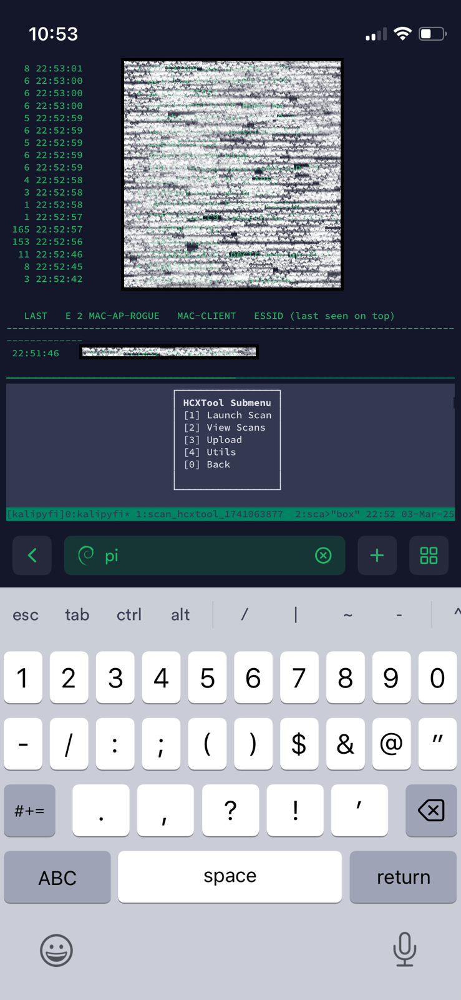

## Install:
```angular2html
git clone https://github.com/chungoid/kalipyfi
cd ~/kalipyfi
python3 -m venv .venv
source .venv/bin/activate
pip install -r requirements.txt
```
## Setup:
```angular2html
change install dir path
KALIPIFI_DIR="/your/path/kalipyfi/"
chmod +x kalipyfi
mv kalipyfi /usr/local/bin/
```
## Usage:
```
sudo kalipyfi
```
## Configs:

Optional: wpasec-key & autobpf

- wpasec-key: for using upload menu with your key.
- autobpf: safeguard.. auto-filter attached interfaces & their associated ap's & clients
- Configs set in tools/hcxtool/configs/config.yaml or alternatively
you can use the menu builder. Every future tool will share the same dir structure
and have their own configs dir.

Example: 
```
interfaces:
  wlan:
  - description: hotspot
    locked: true
    name: wlan0
  - description: monitor
    locked: false
    name: wlan1
  - description: client
    locked: false
    name: wlan3
presets:
  1:
    description: aggressive
    options:
      --gpsd: true
      -A: true
      -F: true
      autobpf: true
  2:
    description: silent
    options:
      --attemptapmax: 0
      --disable_beacon: true
      --gpsd: true
      -F: true
  3:
    description: rca p
    options:
      --gpsd: true
      --rcascan: p
      -A: true
      -F: true
      autobpf: true
user:
  wpasec-key:
```

## Future:
- will be adding more tools. essentially any cli based wireless tool can easily be adopted
into this platform if you want to make your own modules just place them in the tools directory
and have at it.

## Final notes:
- I've enabled discussions so feel free to ask questions or post concerns. Enjoy!